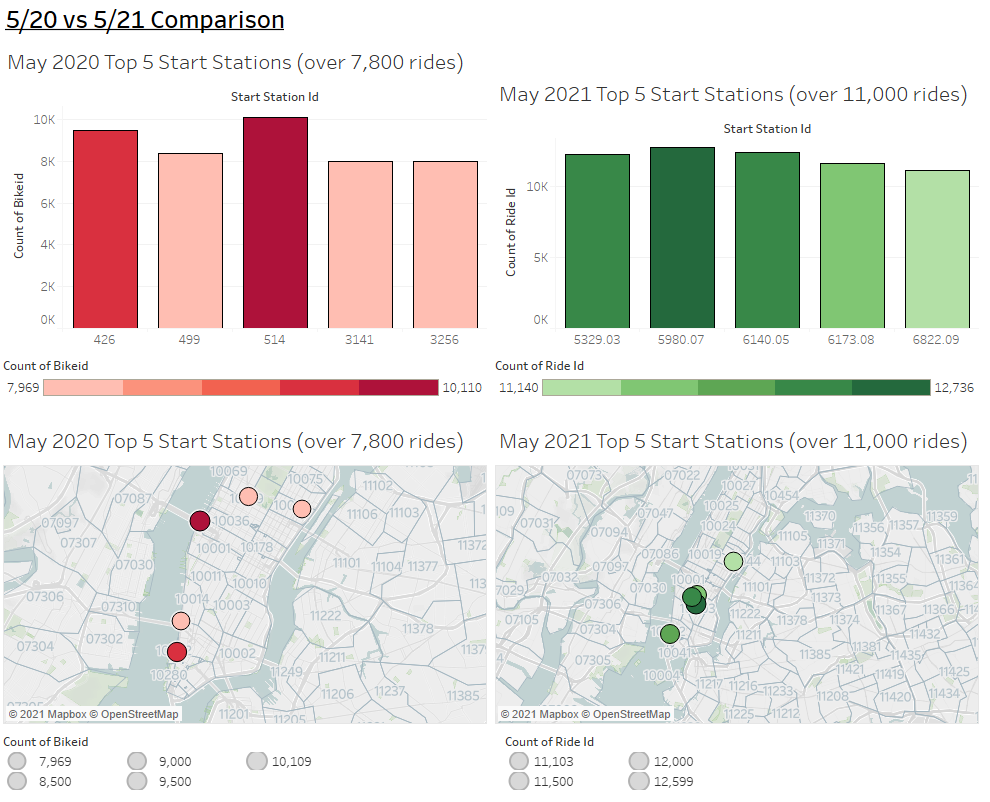
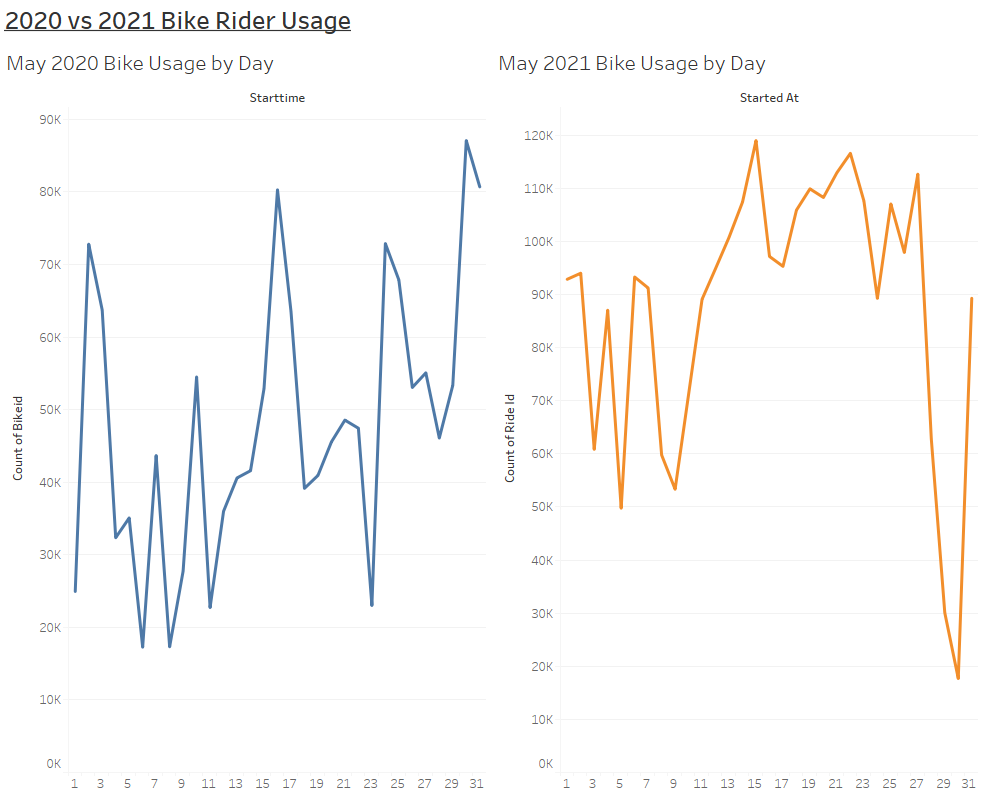

# Citi Bike Data Exploration & Visualization Using Tableau

### To Explore the Tableau Public Link Click Below: 

[Tableau Exploration Link](https://public.tableau.com/views/Tableau-Challenge_16260267834510/BikeUsage20vs21?:language=en-US&:display_count=n&:origin=viz_share_link).

## Goal of the Project: 

Since 2013, the Citi Bike Program has implemented a robust infrastructure for collecting data on the program's utilization.  The goal of this project is to come up with interesting takeaways from the data collected here and to organize it into compelling visualizations using Tableau.  

## Tools / Languages: 
Jupyter Lab, Python, Pandas, Tableau

## Data Utilized 
[Citi Bike Data](https://www.citibikenyc.com/system-data)

## What Questions Do We Answer? 

1) How does CitiBike usage compare from 2020 with that of 2021.  Specifically, I chose to compare the months of May 2020 vs May 2021 as it was most recent.
   1) What are the top 5 stations for each time period?
      1) Bar Graph
      2) Map
   2) Most Popular Stations
      1) Map
   3) Bike Usage By Gender (2020 only)
   4) Bike Usage by Day

## Sample Images / Takeaways 

